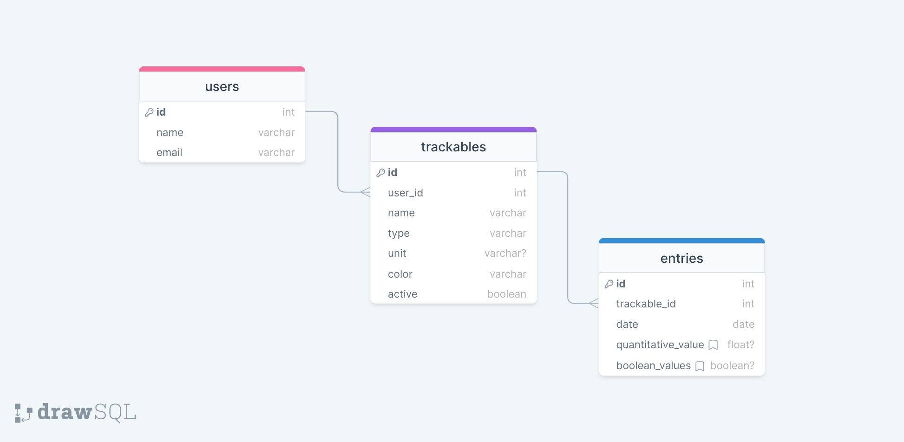

# About UdoU
UdoU is a customizable wellness tracker app. It allows users to keep track of what matters to them by creating their own custom trackables and adding daily entries.

## Motivation

## Features

## Tools
[ESlint](https://eslint.org/docs/latest/user-guide/getting-started) - 
[Create React App](https://facebook.github.io/create-react-app/docs/getting-started) - 
[React](https://reactjs.org/) - 
[Styled components](https://styled-components.com/) - 
[Ant Design](https://ant.design/components/overview/) - 
[Recharts](https://recharts.org/en-US/api)
## Getting started with UdoU
**Important!** This repo contains the frontend of the project.\
Don't forget to clone the [udou-server repo](https://github.com/vic-fb/udou-server) and follow the instructions there.

In the project directory, run `npm install`. Next, `npm start` to run the app in development mode.

Open [http://localhost:3000](http://localhost:3000) to view it in your browser.

## Database schema

## API schema
You can find the API routes in [this document](https://docs.google.com/document/d/1zNp3uwuJBbnv7twVMUb_M4-jy7sNyfh65h0pRNqLdYA/edit?usp=sharing).

## Future features